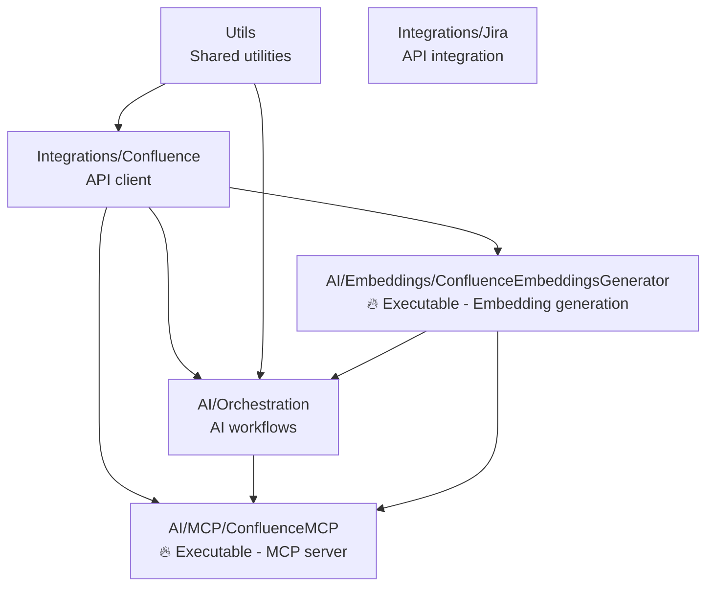

# Tools.ExternalDevServices Solution

## Solution Structure

```
Tools.ExternalDevServices/
├── Tools.ExternalDevServices.sln
├── Utils/                                 # Shared utilities and helpers
├── Integrations/                          # External service integrations
│   ├── Confluence/                        # Confluence REST API client
│   └── Jira/                             # Jira API integration
└── AI/                                   # AI and LLM-powered components
    ├── Orchestration/                    # AI workflow coordination
    ├── MCP/                             # Model Context Protocol servers
    │   └── ConfluenceMCP/               # Confluence MCP server (executable)
    └── Embeddings/                      # Document embedding generation
        └── ConfluenceEmbeddingsGenerator/ # Confluence embeddings tool (executable)
```

## Projects and Dependencies

### Core Infrastructure
- **Utils** (`Tools.ExternalDevServices.Utils`)
  - Shared utility functions and helpers
  - HTML parsing and manipulation tools
  - Logging infrastructure
  - No external project dependencies

### Integration Layer
- **Integrations/Confluence** (`Tools.ExternalDevServices.Integrations.Confluence`)
  - Confluence REST API client and document retrieval
  - HTML to Markdown conversion capabilities
  - Document metadata management and storage
  - **Dependencies**: Utils

- **Integrations/Jira** (`Tools.ExternalDevServices.Integrations.Jira`)
  - Jira API integration for issue tracking
  - Board and issue management endpoints
  - **Dependencies**: None

### AI Services Layer
- **AI/Orchestration** (`Tools.ExternalDevServices.AI.Orchestration`)
  - AI workflow coordination and agent management
  - Confluence-specific AI agents and flows
  - Integration between different AI components
  - **Dependencies**: Confluence, Utils, ConfluenceEmbeddingsGenerator

- **AI/Embeddings/ConfluenceEmbeddingsGenerator** (`Tools.ExternalDevServices.AI.Embeddings.ConfluenceEmbeddingsGenerator`)
  - **Executable console application** for generating document embeddings
  - Semantic Kernel integration with Ollama and SQLite vector storage
  - Confluence document processing and segmentation
  - Software requirements analysis and Q&A extraction
  - **Dependencies**: Confluence

- **AI/MCP/ConfluenceMCP** (`Tools.ExternalDevServices.AI.MCP.ConfluenceMCP`)
  - **Executable console application** serving as MCP server
  - Model Context Protocol implementation for Confluence integration
  - Command-line interface with personal access token authentication
  - **Dependencies**: Confluence, Orchestration, ConfluenceEmbeddingsGenerator

## Dependency Graph



## Key Technologies by Project

### AI/Embeddings/ConfluenceEmbeddingsGenerator
- **Microsoft.Extensions.AI.Ollama** - Local LLM integration
- **Microsoft.SemanticKernel.Connectors.Ollama** - Semantic Kernel Ollama connector
- **Microsoft.SemanticKernel.Connectors.SqliteVec** - Vector database storage
- **CommandLineParser** - CLI argument processing

### AI/MCP/ConfluenceMCP  
- **ModelContextProtocol.AspNetCore** - MCP server implementation
- **CommandLineParser** - CLI interface with token authentication

### AI/Orchestration
- **Microsoft.Extensions.AI** - AI abstraction layer
- **ModelContextProtocol** - MCP client capabilities

## Application Entry Points

### ConfluenceEmbeddingsGenerator (Console App)
- Processes Confluence documents to generate vector embeddings
- Supports software requirements analysis and Q&A extraction
- Integrates with local Ollama models for embedding generation
- Stores vectors in SQLite database for similarity search

### ConfluenceMCP (Console App)
- Provides MCP server interface for Confluence document access
- Requires `--personal-access-token` and `--series` command-line arguments
- Enables AI assistants to query and retrieve Confluence content
- Supports real-time document retrieval and processing

## Development Guidelines

### When Working on Integration Projects
- Focus on clean API abstractions and proper error handling
- Implement both sync and async methods for external API calls
- Use proper configuration patterns for credentials and endpoints
- Include comprehensive logging for debugging API interactions

### When Working on AI Projects
- Use cancellation tokens for long-running embedding operations
- Implement proper memory management for large document processing
- Support batch processing for multiple documents
- Provide clear progress reporting for lengthy operations

### When Working on Executable Projects
- Validate command-line arguments early and provide clear error messages
- Implement graceful shutdown handling for long-running processes
- Use console colors and formatting for user-friendly output
- Support debug modes and verbose logging options